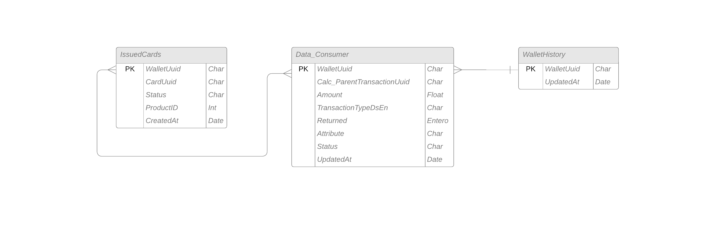

# Tarea 3
### Esquema de Modelo Relacional

#### Operadores de álgebra lineal
**1. Consulta los clientes que hagan transacciones de tipo "Load_Money" y que el monto sea mayor a 100 dlls.**

###### Π TransactionTypeDsEn.WalletUuid.Amount 
###### (σ (Data_Consumer.TransactionTypeDsEn="Load_Money") ^ (Data_Consumer.Amount>100) (Data_Consumer))
    
**2. Muestra los clientes que han realizado transacciones de tipo "International_Transfer" y que tienen una tarjeta fisica.**

###### Π TransactionTypeDsEn.WalletUuid.ProductID 
###### (σ (Data_Consumer.WalletUuid=IssuedCards.WalletUuid) ^ (Data_Consumer.TransactionTypeDsEn="International_Transfer") ^ (IssuedCards.ProductID=2010) (Data_Consumer x IssuedCards))
    

**3. Consulta los clientes con transacciones fallidas y que se registraron en el 2024.**

###### Π Status.WalletUuid.UpdatedAt 
###### (σ (Data_Consumer.WalletUuid=WalletHistory.WalletUuid) ^ (Data_Consumer.Status<>"Completed") ^ Year(WalletHistory.UpdatedAt=2024) (Data_Consumer x WalletHistory))

**4. Consulta los clientes registrados en 2023 que realizaron transacciones pero que no tienen tarjeta**

###### Π Status.WalletUuid.UpdatedAt.CardUuid 
###### (σ (Data_Consumer.WalletUuid=WalletHistory.WalletUuid) ^ (Data_Consumer.WalletUuid=IssuedCards.WalletUuid) ^(Data_Consumer.Status="Completed") ^ Year(WalletHistory.UpdatedAt=2023) ^ (IssuedCards.CardUuid=null)  (Data_Consumer x WalletHistory))
