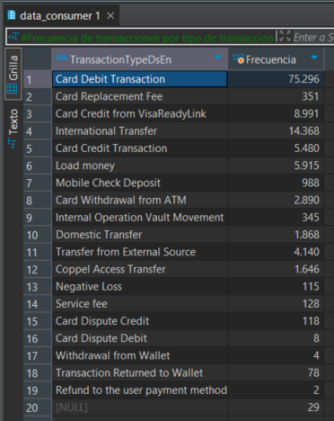
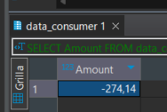

# Tarea 6

## Consulta 1

### Frecuencia de transacciones por tipo de transaccion

##### SELECT TransactionTypeDsEn, COUNT(*) AS Frecuencia
##### FROM data_consumer
##### GROUP BY TransactionTypeDsEn;

## Consulta 2
### Minimo, Maximo y Promedio de monto cuando la transaccion es de tipo "Load Money"

##### SELECT MIN(Amount) AS Minimo, MAX(Amount) AS Maximo, round(AVG(Amount),2) as Promedio
##### FROM data_consumer
##### where TransactionTypeDsEn = 'Load Money';

## Consulta 3
### La siguiente consulta nos dice cual es el monto de la remesa enviada que mas se repite

##### SELECT Amount AS Moda, COUNT(*) AS Frecuencia
##### FROM data_consumer
##### WHERE TransactionTypeDsEn = 'International Transfer'
##### GROUP BY Amount
##### ORDER BY COUNT(*) DESC
##### LIMIT 1;

## Consulta 4
### Cuantil .75 de los montos de las transacciones de tipo "International Transfer"

##### SELECT COUNT(*)*.75 as Datos  FROM (SELECT Amount
##### FROM data_consumer
##### WHERE TransactionTypeDsEn = 'International Transfer'
##### ORDER BY Amount desc) as SUBCONJUNTOS;
### De la consulta anterior, hacemos la siguiente:

##### SELECT Amount
##### FROM data_consumer
##### WHERE TransactionTypeDsEn = 'International Transfer'
##### ORDER BY Amount DESC
##### LIMIT 10775, 1;

### Dificultades 
##### Encontré dificultades al intentar calcular el cuantil por lo que, para resolver este problema, adopté un enfoque diferente. Primero, realicé una subconsulta para contar el número total de valores de montos ordenados de mayor a menor. Luego, multipliqué este número por 0.75 para establecer el número de datos que representaría el 75% del total de datos. Después de obtener este valor, lo ingresé manualmente en la función LIMIT de un nuevo query. Esto me permitió seleccionar el valor en esa posición específica y así obtener el cuantil 0.75 deseado. 